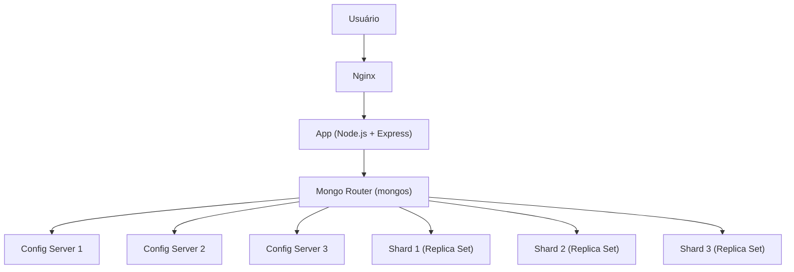

# Your Story — Plataforma Distribuída de Histórias Anônimas

Este projeto é uma aplicação web para compartilhar histórias anonimamente, construída para demonstrar conceitos de **Sistemas Distribuídos** utilizando **MongoDB Sharding, replicação e balanceamento de carga com Nginx**.

A arquitetura foi projetada para garantir **escalabilidade horizontal**, **alta disponibilidade** e **tolerância a falhas**.

---

## Funcionalidades da Aplicação

- Criar histórias com título, descrição (opcional) e conteúdo em **Markdown**.
- Listar histórias mais recentes na página inicial.
- Visualizar histórias individualmente com URLs amigáveis (*slug*).
- Editar e excluir histórias.
- Conversão automática de Markdown para HTML seguro (**sanitização contra XSS**).
- Renderização com **EJS templates**.
- Servir arquivos estáticos pela rota `/public`.

---

## Tecnologias Utilizadas

- **Backend**: Node.js, Express, Mongoose.
- **Banco de Dados**: MongoDB com **sharding** e **replicação**.
- **Frontend**: HTML, CSS, EJS Templates.
- **Segurança**: `dompurify` + `marked` para sanitização de HTML.
- **Containerização**: Docker, Docker Compose.
- **Proxy**: Nginx.
- **Arquitetura Distribuída**: Config Servers, Shards, Router (`mongos`).

---

## Estrutura do Projeto

```
your-story-distributed/
│
├── server.js                # Servidor Express
├── models/article.js         # Modelo de dados do artigo
├── routes/articles.js        # Rotas de CRUD
├── views/                    # Templates EJS
├── public/                   # Arquivos estáticos (CSS, imagens)
├── docker-compose.yml        # Orquestração principal (App + Mongo + Nginx)
├── conf.d/                   # Configuração do Nginx
└── mongodb cluster/          # Configuração do cluster shardado
    ├── mongodb config-server/ # Config Servers (3 instâncias)
    ├── mongodb router/        # Router (mongos)
    ├── mongodb shard01/       # Shard 1 (replica set)
    ├── mongodb shard02/       # Shard 2 (replica set)
    └── mongodb shard03/       # Shard 3 (replica set)
```

---

## Arquitetura de Sistemas Distribuídos

O MongoDB foi configurado com:

### Config Servers
Armazenam metadados e mapeamento dos shards:
- **mongo-config01**
- **mongo-config02**
- **mongo-config03**
  
Rodam com:
```bash
mongod --configsvr --replSet configserver --port 27017
```

### Shards
Cada shard é um **replica set** com 2 instâncias:
- **shard01** → `mongo-shard1a`, `mongo-shard1b`
- **shard02** → `mongo-shard2a`, `mongo-shard2b`
- **shard03** → `mongo-shard3a`, `mongo-shard3b`

Rodam com:
```bash
mongod --shardsvr --replSet shardXX
```

### Router (`mongos`)
Responsável por rotear consultas para o shard correto:
```bash
mongos --configdb configserver/mongo-config01:27017,mongo-config02:27017,mongo-config03:27017 --bind_ip_all
```

---

## Diagrama da Arquitetura



---

## Como Executar

### Clonar o repositório
```bash
git clone https://github.com/seuusuario/your-story.git
cd your-story
```

### Subir o cluster MongoDB
Cada pasta `mongodb cluster/*` contém um `docker-compose.yml` específico.  
Inicie os componentes na ordem:
```bash
docker network create mongo-shard
cd "mongodb cluster/mongodb config-server" && docker-compose up -d
cd ../"mongodb shard01" && docker-compose up -d
cd ../"mongodb shard02" && docker-compose up -d
cd ../"mongodb shard03" && docker-compose up -d
cd ../"mongodb router" && docker-compose up -d
```

### Subir a aplicação e Nginx
```bash
cd ../../
docker-compose up --build
```

### Acessar a aplicação
- **App**: [http://localhost:5000](http://localhost:5000)
